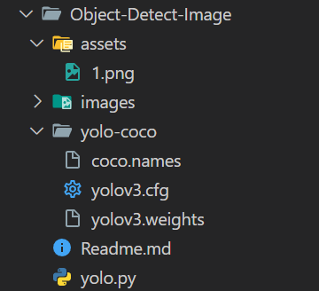
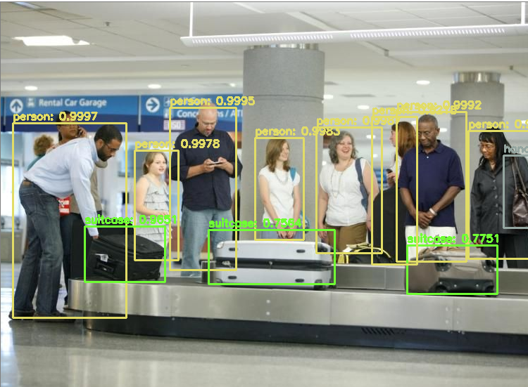

# Object Detect Image

## Usage

```
python yolo.py --image {pathImage}
```

## Example Usage

```
python yolo.py --image images/baggage_claim.jpg
```

## Structure Folder



## Setup Project

1. Create yolo-coco folder like the structure image
1. download yolo dataset
   - https://www.kaggle.com/datasets/shivam316/yolov3-weights
2. download coco.names
   - https://github.com/pjreddie/darknet/blob/master/data/coco.names
3. download yolo.cfg
   - https://github.com/cvjena/darknet/blob/master/cfg/yolo.cfg

## Example Output


