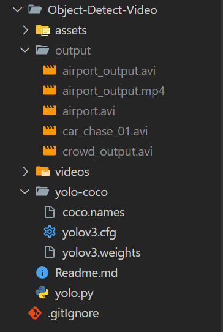

# Object Detect Video

## Usage
```
python yolo.py --input {pathVideoInput} --output {pathVideoOutput} --yolo yolo-coco
```
## Example Usage
```
python yolo.py --input videos/airport.mp4 --output output/airport_output.avi --yolo yolo-coco
```

## Structure Folder


## Extension File Output
### `.avi` 
fourcc = cv2.VideoWriter_fourcc(*"MJPG")
### `.mp4` 
fourcc = cv2.VideoWriter_fourcc('m', 'p', '4', 'v')

## Setup Project 
1. Create yolo-coco and output folder like the structure image
1. download yolo dataset
    - https://www.kaggle.com/datasets/shivam316/yolov3-weights
2. download coco.names
    - https://github.com/pjreddie/darknet/blob/master/data/coco.names
3. download yolo.cfg
    - https://github.com/cvjena/darknet/blob/master/cfg/yolo.cfg


## Example Output

